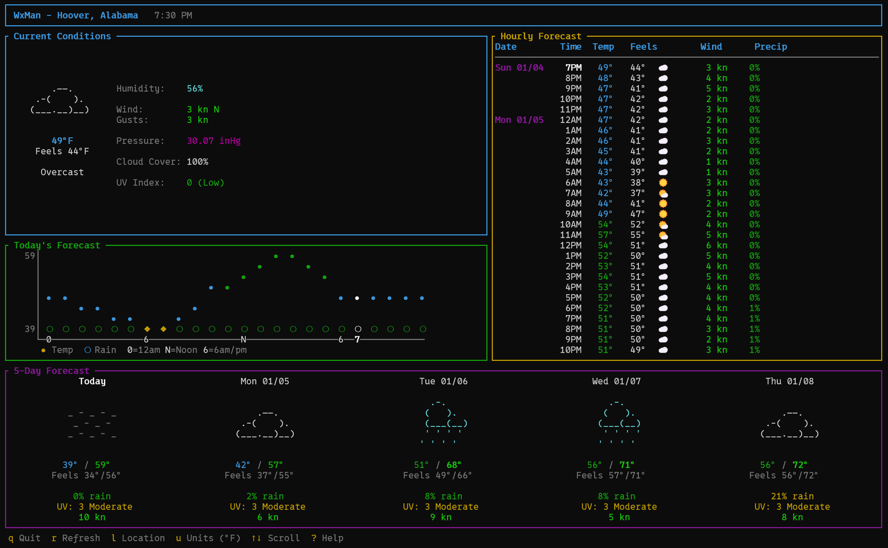

# wxman

A terminal-based weather application built with Rust and [Ratatui](https://ratatui.rs/).



## Features

- **Current Conditions** - Temperature, feels like, humidity, wind, pressure, UV index, cloud cover, precipitation
- **Hourly Forecast** - Scrollable 24+ hour forecast with temperature, conditions, and precipitation probability
- **5-Day Forecast** - Daily high/low temps, weather conditions, rain chance, UV index, and wind
- **Auto-detect Location** - Uses IP geolocation by default, or configure a zip code
- **Configurable Units** - Toggle between imperial and metric units
- **Auto-refresh** - Weather data updates every 15 minutes
- **Bright, Colorful UI** - Temperature color-coded from blue (cold) to red (hot), weather-specific icons

## Installation

### Homebrew (macOS/Linux)

```bash
brew install benwyrosdick/tap/wxman
```

### From Source

Requires [Rust](https://rustup.rs/) 1.70 or later.

```bash
# Clone the repository
git clone https://github.com/yourusername/wxman.git
cd wxman

# Build and install
cargo install --path .
```

### Build Only

```bash
cargo build --release
# Binary will be at ./target/release/wxman
```

## Usage

Simply run:

```bash
wxman
```

### Keyboard Controls

| Key | Action |
|-----|--------|
| `q` / `Esc` | Quit |
| `r` | Refresh weather data |
| `l` | Set location |
| `u` | Open units menu |
| `↑` / `k` | Scroll hourly forecast up |
| `↓` / `j` | Scroll hourly forecast down |
| `?` | Show help |

### Location

Press `l` to open the location input dialog. You can enter:
- A **city name** (e.g., "New York")
- A **zip code** (e.g., "90210")
- Leave **empty** to use automatic IP-based geolocation

The location is saved to your config file and persists between sessions.

### Units Menu

Press `u` to open the units configuration menu:

- **Temperature**: °F or °C
- **Wind Speed**: mph, km/h, m/s, or knots
- **Precipitation**: in or mm
- **Pressure**: inHg or hPa

Use `↑`/`↓` to navigate, `Enter` or `Space` to toggle, and `u` or `Esc` to close and apply.

## Configuration

wxman stores its configuration at:

- **Linux/macOS**: `~/.config/wxman/config.toml`
- **Windows**: `%APPDATA%\wxman\config.toml`

### Example Configuration

```toml
[location]
# Uncomment to use a specific zip code instead of IP geolocation
# zipcode = "90210"

# Or use explicit coordinates
# latitude = 34.0901
# longitude = -118.4065
# city = "Beverly Hills"

[units]
temperature = "fahrenheit"  # or "celsius"
wind_speed = "mph"          # or "kmh", "ms", "knots"
precipitation = "inch"      # or "mm"
pressure = "inhg"           # or "hpa"
```

## Data Sources

- **Weather Data**: [Open-Meteo](https://open-meteo.com/) - Free, no API key required
- **IP Geolocation**: [ipapi.co](https://ipapi.co/) - Free tier, no API key required
- **Geocoding**: [Open-Meteo Geocoding API](https://open-meteo.com/en/docs/geocoding-api)

## Requirements

- A terminal with Unicode support (for weather icons)
- Terminal size of at least 80x24 recommended

## License

MIT

## Acknowledgments

- [Ratatui](https://ratatui.rs/) - Terminal UI framework
- [Open-Meteo](https://open-meteo.com/) - Weather API
